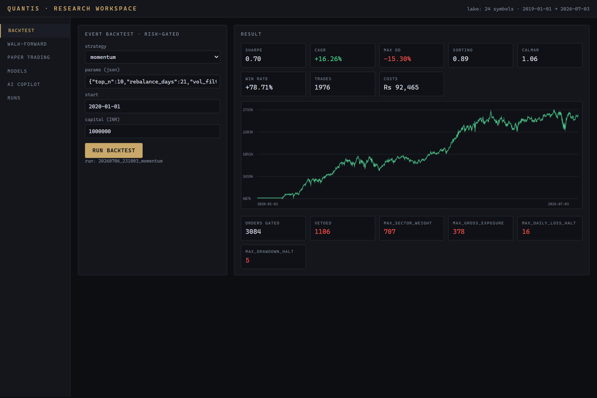
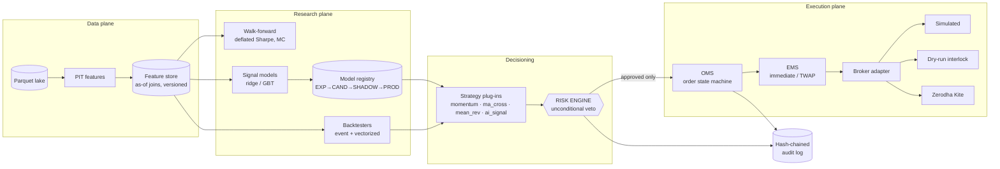
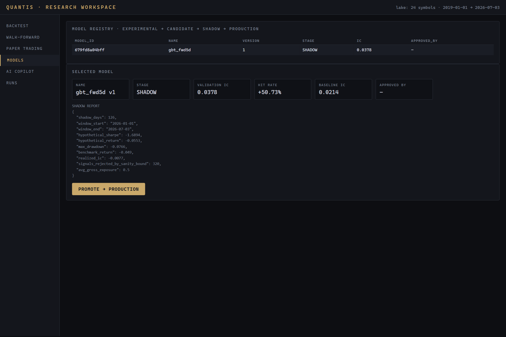
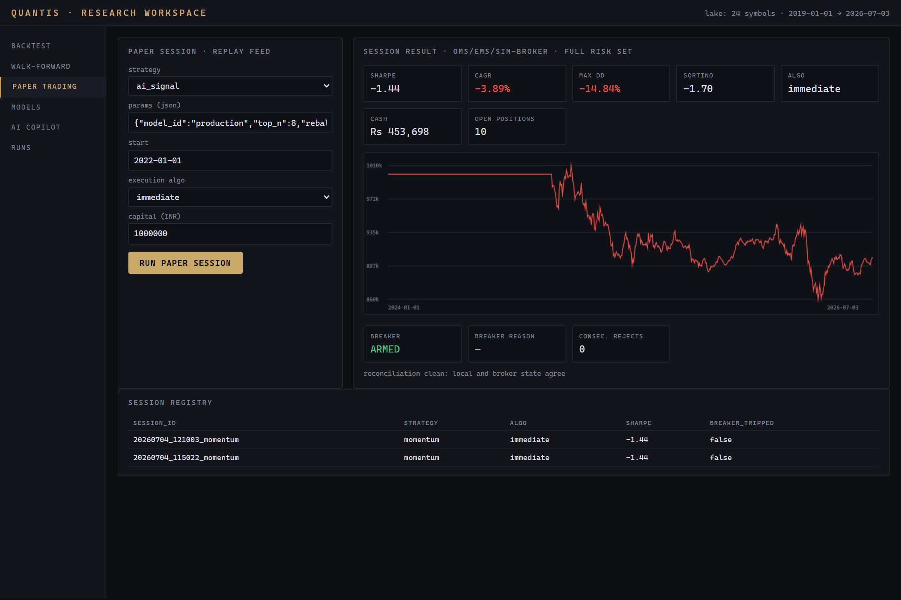

# Quantis

**An institutional-grade AI quantitative research and execution platform for Indian markets (NSE), built solo, end to end: data → features → backtest → walk-forward → paper trading → governed AI signals → (unarmed) live trading.**

[](https://github.com/RickyVishwakarma/quantis/actions)


Quantis is not a trading bot. It is the research-to-execution infrastructure a small
quant desk would need — a risk engine with unconditional veto authority, an OMS/EMS with
a real order-state machine, a governed ML model lifecycle, and a tamper-evident audit
trail — implemented from a 27-page technical design document
([`docs/quantisMVP.pdf`](docs/quantisMVP.pdf)) through its first five roadmap phases.

<p align="center">
  <br>
  <em>Research workspace: risk-gated event backtest on real NSE data — note the veto breakdown by risk rule under the equity curve.</em>
</p>

## The honest numbers (and why they're the point)

Most hobby trading projects show a beautiful in-sample equity curve. Quantis is built to
**destroy** those curves before they cost money, and the real-data results show every
layer doing its job:

| What happened | Where |
|---|---|
| Momentum backtest: **+162%, Sharpe 0.70** in-sample (2020–2026, real NSE data) | `quantis backtest` |
| The same strategy under walk-forward validation: **OOS Sharpe −0.19**, 27.8% bootstrap probability the true Sharpe is negative | `quantis walkforward` |
| GBT signal model: validation IC 0.038, beat the momentum baseline (0.021) → CANDIDATE | `quantis ai train` |
| Same model in shadow mode (most recent 6 months): **Sharpe −1.69, realized IC −0.008** → correctly **refused production** | `quantis ai shadow` |
| Paper engine vs backtester, same inputs, full OMS/EMS/broker stack in between: **0.19% terminal-wealth gap** | parity test |
| Live session demo: **2,815-record hash-chained audit trail, verified end-to-end**, incl. a circuit-breaker trip that cancelled resting orders and halted until manual reset | `quantis live` |

The system's job is to make the gap between in-sample fantasy and out-of-sample reality
visible *before* capital is at risk. It does.

## Architecture

Single Python package, module boundaries deliberately mirroring the TDD's service
decomposition (each module extracts to a service when scale demands):



**Non-negotiable invariants, enforced in code and covered by tests:**

- **Every order transits the risk engine** — position/sector/exposure/liquidity caps,
  daily-loss halts, tiered drawdown response (halve → flatten → halt), circuit breakers
  (consecutive rejections, feed staleness, broker errors, panic button), manual-only
  reset. AI-sourced orders get the identical limits plus out-of-distribution signal
  bounds and per-model capital caps.
- **One code path from research to live** — the same strategy weights feed the
  vectorized sweeper, the event backtester, the paper engine, and the live engine;
  paper vs live differ only in which `BrokerAdapter` is constructed.
- **No look-ahead, mechanically proven** — a perturbation test rewrites all future bars
  and asserts every feature, every strategy, and every AI prediction at/before the
  cutoff is bit-identical.
- **A model cannot reach production without** beating a baseline on validation IC, a
  shadow-mode report, and a named human sign-off — the registry refuses otherwise.
- **Live is unarmed by default** — a real broker without `--arm-live` is auto-wrapped
  in a dry-run interlock that journals intent and places nothing.

<p align="center">
  <br>
  <em>Model registry: the GBT model that beat its baseline in validation but failed shadow — held at SHADOW, exactly as designed.</em>
</p>

## What's inside

| Subsystem | Module | Highlights |
|---|---|---|
| Data lake | `quantis/data/` | NSE daily bars as Parquet; Yahoo (`.NS`) + deterministic synthetic source for CI |
| Features | `quantis/features/` | Point-in-time contract: row *t* uses only data through close *t* |
| Feature store | `quantis/fstore/` | TDD schema `(instrument_id, feature_name, as_of_ts, value, schema_version)`; as-of joins; training frames with strictly-future labels |
| Backtesting | `quantis/backtest/` | Event-driven (risk-gated, integer cash) + vectorized (sweeps), one shared NSE cost model: brokerage/STT/stamp/exchange/SEBI/GST + √-impact slippage |
| Validation | `quantis/research/` | Rolling walk-forward, stitched OOS equity, block-bootstrap Monte Carlo, deflated Sharpe; experiment tracking (MLflow or local JSONL) |
| Risk | `quantis/risk/` | Veto engine + live layer: tiered drawdown, vol targeting, circuit breakers; every decision logged with the limit snapshot in force |
| OMS / EMS | `quantis/oms/` `quantis/ems/` | TDD status lifecycle (`PENDING_RISK → … → FILLED`), illegal transitions raise, append-only journal; TWAP slicing with measurably lower impact |
| Brokers | `quantis/broker/` | One interface: simulator, dry-run interlock, Zerodha Kite (tag-based idempotency — timeout-after-land never double-executes, tested against a fake client) |
| Paper/live | `quantis/paper/` `quantis/live/` | Same engine; live adds reconciliation at start/periodic/EOD, breaker-trip order cancellation, SEBI algo tagging |
| AI | `quantis/ai/` | Ridge (exactly attributable) + LightGBM signal models; governed registry; shadow mode; Claude-powered copilot grounded in platform state (read-only, local fallback) |
| Audit | `quantis/audit/` | Append-only SHA-256 hash chain; editing or deleting any record breaks `verify()` at that sequence |
| UI / API | `quantis/api.py` `web/` | FastAPI (`/v1/...`) + terminal-style workspace: backtest, walk-forward, paper, model registry, copilot |

<p align="center">
  <br>
  <em>Paper trading: session registry, equity curve, circuit-breaker state, and OMS-vs-broker reconciliation.</em>
</p>

## Quickstart

```bash
pip install -e ".[data,research,dev]"

quantis ingest --source yahoo --start 2019-01-01   # real NSE data (or --source synthetic)
quantis backtest --strategy momentum               # risk-gated event backtest
quantis walkforward --strategy momentum --grid top_n=5,10 --grid rebalance_days=21,42
quantis paper --strategy ma_crossover --parity     # OMS/EMS/sim-broker + parity report
quantis ui                                         # research workspace at :8000

# AI lifecycle (pip install -e ".[ai]")
quantis ai train --model gbt
quantis ai shadow --model <id>
quantis ai promote --model <id> --to PRODUCTION --approved-by <you>   # refuses without sign-off

# Live path (pip install -e ".[live]") — UNARMED by default
quantis live --strategy momentum --algo-id SEBI-XXX                   # sim broker
quantis live --broker zerodha --algo-id SEBI-XXX                      # dry run: journals, never places
quantis live --broker zerodha --algo-id SEBI-XXX --arm-live           # real orders (your call, not the code's)

pytest   # 119 tests: cost model, risk rules, state machines, parity, look-ahead perturbation, audit chain
```

## Design decisions worth reading the code for

1. **The risk engine can only say no.** Strategies size positions; risk vetoes. There is
   no code path where risk "adjusts" an order — veto or pass. This keeps the audit
   trail interpretable: every fill maps to exactly one approval under a recorded limit
   snapshot. (`quantis/risk/engine.py`)
2. **The double-execution problem is solved with order tags, not hope.** A network
   timeout after the broker accepted an order is the classic way retail algos
   double-buy. The Kite adapter re-queries by idempotency tag before re-placing;
   the test suite simulates timeout-after-land explicitly. (`quantis/broker/zerodha.py`)
3. **Backtest honesty is a test suite, not a promise.** Look-ahead is checked by
   perturbation, walk-forward selection happens strictly on train windows, sweeps are
   penalized with the deflated Sharpe, and the paper engine's parity with the
   backtester is asserted numerically. (`tests/`)
4. **Infrastructure is deliberately boring at this scale.** Parquet instead of
   TimescaleDB, JSONL instead of Kafka, one process instead of microservices — but with
   the TDD's schemas and interfaces, so each swap is a backend change. The
   `docker-compose.yml` stages the real stack.
5. **AI is a strategy plug-in, not a special citizen.** Model signals become target
   weights through the same interface as a moving-average crossover, and get *extra*
   safeguards (signal sanity bounds, per-model caps), not exemptions.

## Status & roadmap

Phases 1–5 of the TDD are complete (research loop, research platform, paper trading,
AI integration, live path). Known gaps, tracked honestly: survivorship-biased universe
(needs historical index membership), VWAP/Iceberg/SOR (need intraday data),
correlation-based concentration limits, stress-scenario replays, deep sequence models,
Next.js frontend, real-time licensed market data. Phase 6 (multi-tenant, marketplace,
white-label) is deliberately out of solo scope.

## Disclaimer

Educational/portfolio software. Nothing here is investment advice. The live path ships
unarmed for a reason: markets are efficient enough to be humbling, and this project's
own walk-forward results prove it.
